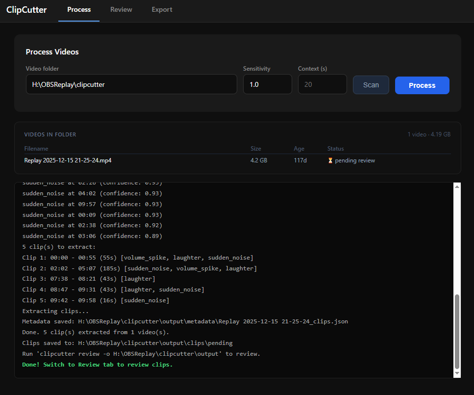
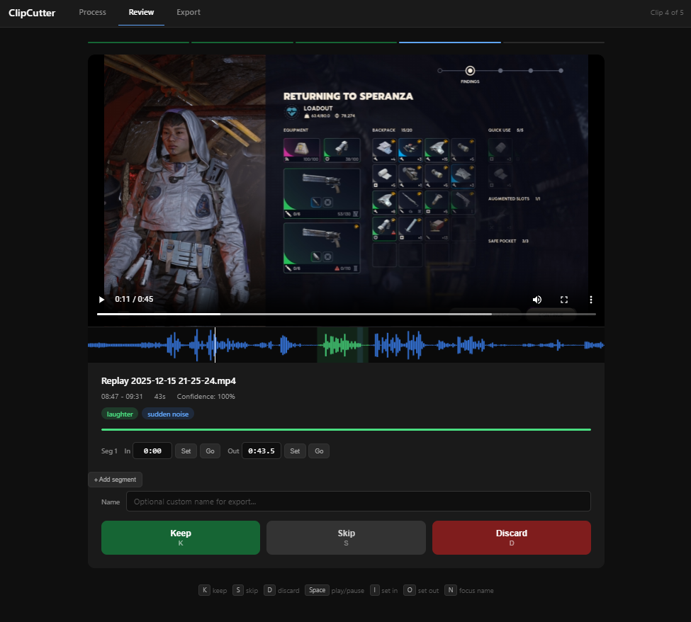
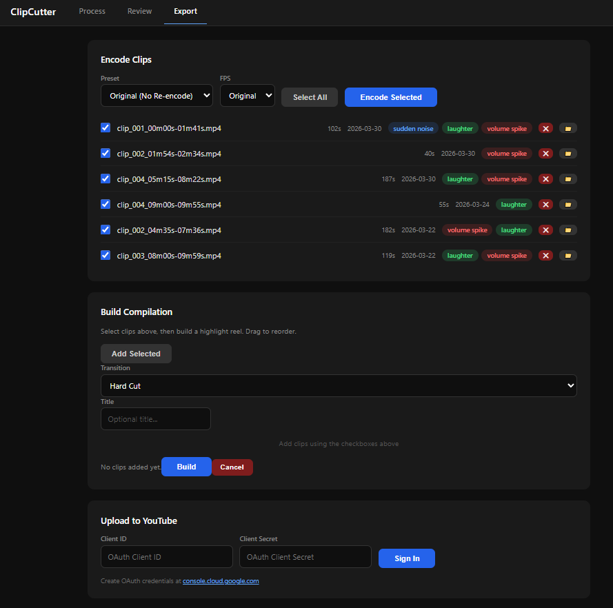

# ClipCutter

Audio-based video highlight extractor. Point it at a folder of gaming recordings and it automatically finds the good moments — volume spikes, laughter, shouting, sudden noises — and pulls them out as clips for you to review and export.

## How it works

1. **Process** — analyzes audio to detect highlight events and extracts clips
2. **Review** — watch each clip, trim it, name it, keep or discard
3. **Export** — encode, build compilations, upload to YouTube

## Screenshots

### Process
Scan a folder, adjust sensitivity, and process. A live log shows detected events and extracted clips.



### Review
Full video player with waveform visualization and highlight overlays. Set in/out points, add multiple segments, name the clip, then keep, skip, or discard with keyboard shortcuts.



### Export
Encode clips to different quality presets, drag-and-drop to build a compilation, and upload directly to YouTube.



## Requirements

- Python 3.10+
- [FFmpeg](https://ffmpeg.org/download.html) (must be on PATH)

## Installation

```bash
git clone https://github.com/curtyo18/ClipCutter.git
cd ClipCutter
pip install -e .
```

## Usage

### Web UI (recommended)

```bash
python -m clipcutter ui
```

Opens a browser at `http://localhost:8000` with the Process, Review, and Export tabs.

On Windows you can also double-click `ClipCutter.bat`.

### CLI

```bash
# Process a folder of videos
python -m clipcutter process H:\OBSReplays -o ./output

# Adjust sensitivity (higher = more clips)
python -m clipcutter process H:\OBSReplays -s 1.5

# Dry run — detect highlights without extracting clips
python -m clipcutter process H:\OBSReplays --dry-run

# Terminal-based review (no browser needed)
python -m clipcutter review -o ./output
```

## Features

### Process tab
- Scans a folder and lists videos with size, age, and processing status
- Adjustable sensitivity (0.1–5.0) and context window around each highlight
- Detects: volume spikes, laughter, shouting, sudden noises
- Live processing log

### Review tab
- Video player with interactive waveform
- Colored overlays show which detection type triggered each highlight region
- Trim controls: set in/out points per segment, add multiple segments
- Trim quality: Fast (stream copy), Precise (CRF 16), Ultra (lossless)
- Optional custom name per clip for use during export
- Keyboard shortcuts: `K` keep, `D` discard, `S` skip, `I`/`O` set in/out, `Space` play/pause

### Export tab
- Disk usage summary across kept, encoded, and compilation folders
- Encode presets: Original (copy), High (H.264 CRF 18), Low (H.264 CRF 26), GIF (with optional slowdown)
- Build compilations with hard cut or crossfade transitions, drag to reorder
- Delete encoded versions individually to reclaim space
- Source video cleanup — delete originals once review is complete
- YouTube upload via OAuth2 with title, description, tags, category, and playlist

## Output structure

```
output/
  clips/pending/<video>/      # Awaiting review
  clips/kept/<video>/         # Approved clips
  clips/encoded/<video>/      # Re-encoded clips
  clips/compilations/         # Built compilations
  metadata/<video>_clips.json # Per-clip metadata
```

## Stack

Python, FastAPI, librosa, numpy/scipy, FFmpeg, TypeScript

## Running tests

```bash
pip install pytest httpx playwright
python -m playwright install chromium

pytest tests/ -v                   # Full suite
pytest tests/ -v -k "not browser"  # API tests only (faster)
```
